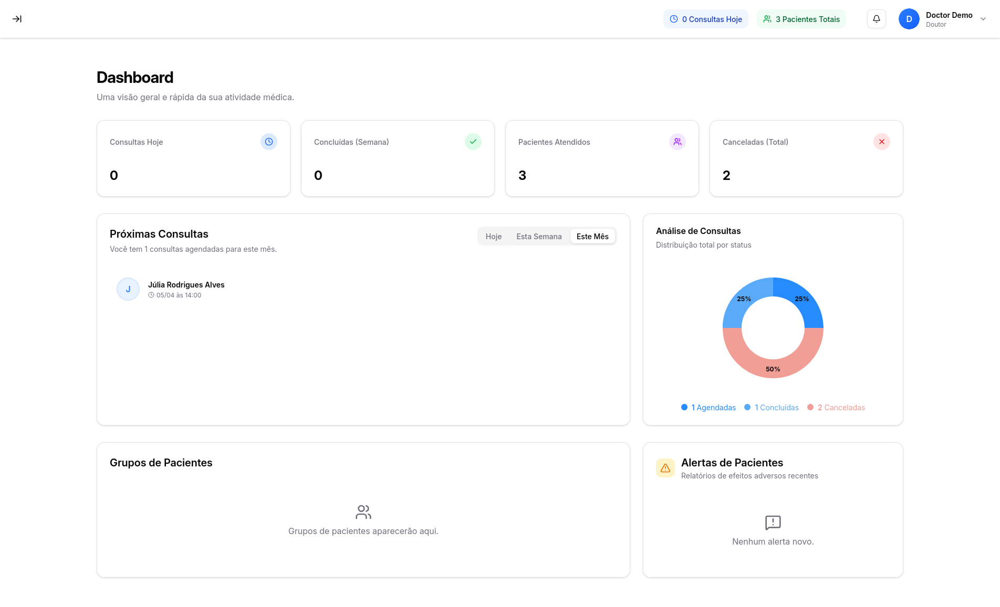
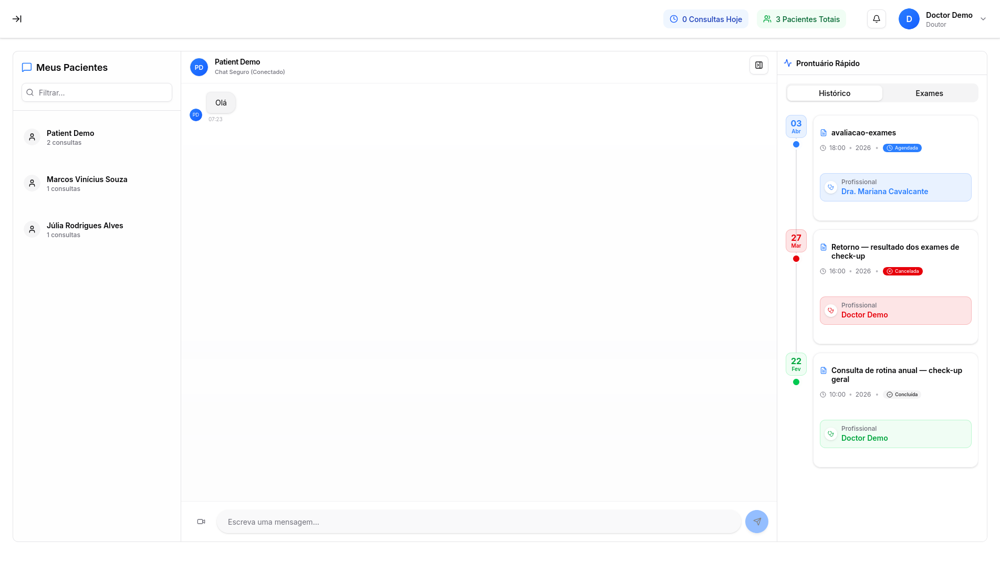
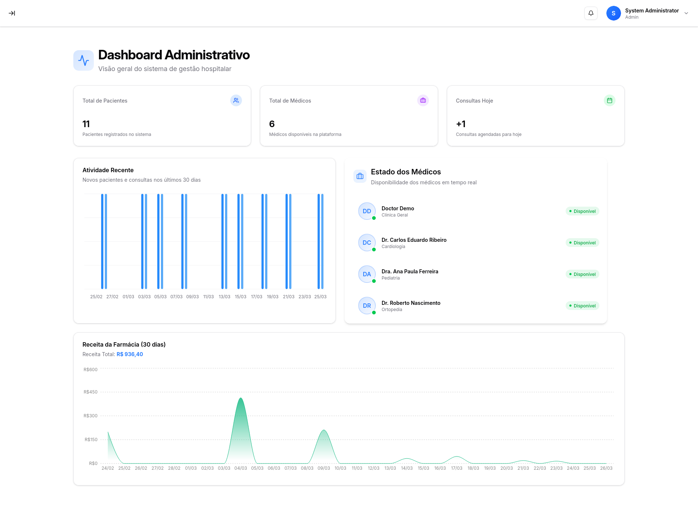
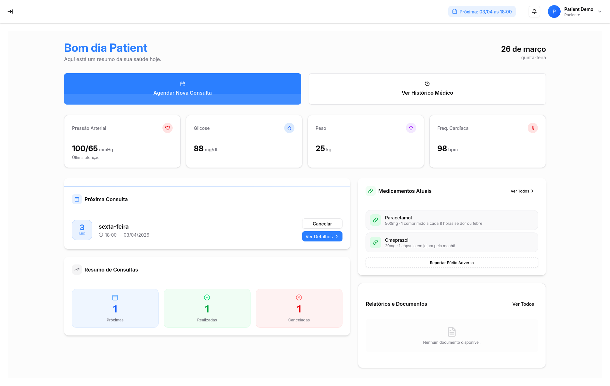
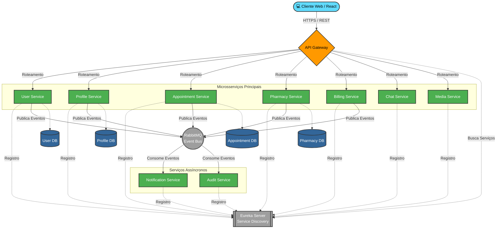

<div align="center">

<a href="https://github.com/saiko9x/hms-fullstack-microservices/actions"></a>


# 🏥 Health Management System (HMS)

**Plataforma fullstack de gestão hospitalar e clínica construída com Arquitetura de Microsserviços**

*Autenticação · Agendamentos · Farmácia · Faturamento · Chat · Auditoria*

</div>

---

## 📋 Índice

- [Visão Geral](#-visão-geral)
- [Galeria do Sistema](#-galeria-do-sistema)
- [Arquitetura do Sistema](#️-arquitetura-do-sistema)
- [Funcionalidades](#-funcionalidades)
- [Stack Tecnológica](#️-stack-tecnológica)
- [Estrutura do Projeto](#-estrutura-do-projeto)
- [Como Executar Localmente](#️-como-executar-localmente)
- [Testes Automatizados](#-testes-automatizados)
- [Dados Iniciais (Seeds) e Credenciais](#-dados-iniciais-seeds-e-credenciais)
- [Endpoints & Dashboards](#-endpoints-e-dashboards)
- [Contribuindo](#-contribuindo)
- [Autor](#-autor)

---

## 🔭 Visão Geral

O **HMS** é um sistema moderno para gestão de saúde desenvolvido para clínicas e hospitais. A arquitetura orientada a
microsserviços garante escalabilidade horizontal, resiliência e isolamento de domínios — cada serviço tem seu próprio
banco de dados e ciclo de vida independente.

A comunicação entre serviços é feita de duas formas:

- **Síncrona** → via API Gateway (REST/HTTPS)
- **Assíncrona** → via RabbitMQ (eventos de domínio)

---

## 📸 Galeria do Sistema

<table style="width: 100%;">
  <tr>
    <td style="text-align: center; vertical-align: top; width: 50%;">
      <b>🩺 Visão do Médico</b><br><br>
      
    </td>
    <td style="text-align: center; vertical-align: top; width: 50%;">
      <b>💬 Chat em Tempo Real</b><br><br>
      
    </td>
  </tr>
  <tr>
    <td style="text-align: center; vertical-align: top; width: 50%;">
      <b>⚙️ Visão do Administrador</b><br><br>
      
    </td>
    <td style="text-align: center; vertical-align: top; width: 50%;">
      <b>🧑‍⚕️ Visão do Paciente</b><br><br>
      
    </td>
  </tr>
</table>

---

## 🏗️ Arquitetura do Sistema



A plataforma segue o padrão de **API Gateway + Service Discovery (Eureka)**. Os microsserviços principais se comunicam
de forma síncrona via Gateway (REST/HTTPS) e publicam eventos de domínio no **RabbitMQ**, consumidos de forma assíncrona
pelos serviços de Notificação e Auditoria. Cada serviço possui seu próprio banco de dados isolado.

---

## ✨ Funcionalidades

| Módulo                            | Descrição                                                          |
|-----------------------------------|--------------------------------------------------------------------|
| 🔐 **Autenticação & Autorização** | Gestão segura de acessos com JWT e Spring Security.                |
| 👤 **Gestão de Perfis**           | Cadastros e históricos para Pacientes, Médicos e Administradores.  |
| 📅 **Agendamentos**               | Marcação de consultas, controle de disponibilidade e telemedicina. |
| 💊 **Farmácia & Estoque**         | Gestão de medicamentos, receitas e dispensação.                    |
| 💰 **Faturamento**                | Geração de faturas, integração com planos de saúde e pagamentos.   |
| 🔔 **Notificações**               | Alertas em tempo real e envio de e-mails via eventos assíncronos.  |
| 💬 **Chat**                       | Comunicação direta entre médico e paciente via WebSocket.          |
| 📁 **Mídia & Documentos**         | Upload seguro e gestão de exames e resultados.                     |
| 📋 **Auditoria**                  | Rastreamento completo de alterações no sistema.                    |

---

## 🛠️ Stack Tecnológica

### Backend — Java / Spring Boot

- **Spring Boot 3.x**
- **Spring Cloud Gateway** (Roteamento centralizado e filtros de segurança)
- **Spring Cloud Netflix Eureka** (Service Discovery e balanceamento de carga)
- **Spring Security + JWT**
- **Spring Data JPA + Flyway** (Persistência e migrações)
- **RabbitMQ** (Comunicação assíncrona orientada a eventos AMQP)

### Frontend — React / TypeScript

- **React.js + TypeScript**
- **Vite** (Bundler)
- **Tailwind CSS** (Estilização UI)
- **Axios** (Integração com APIs do Gateway)

### Infraestrutura & DevOps

- **Docker & Docker Compose**
- **Prometheus & Grafana** (Monitoramento de métricas)
- **Loki & Promtail** (Agregação de logs)
- **Nginx** (Servidor web para o build de produção)

---

## 📁 Estrutura do Projeto

```text
hms-fullstack-microservices/
├── backend/
│   ├── appointment/          # Gestão de consultas e histórico médico
│   ├── audit/                # Trilha de auditoria do sistema
│   ├── billing/              # Faturamento e pagamentos
│   ├── chat/                 # Serviço de mensagens via WebSocket
│   ├── common-lib/           # Bibliotecas e DTOs compartilhados (Core, Web, Security, Messaging)
│   ├── eureka-server/        # Servidor de Service Discovery
│   ├── gateway/              # API Gateway (roteamento + auth filter)
│   ├── media/                # Gerenciamento de arquivos e uploads
│   ├── notification/         # Envio de e-mails e alertas
│   ├── pharmacy/             # Inventário e vendas de farmácia
│   ├── profile/              # Perfis de Médicos e Pacientes
│   ├── user/                 # Autenticação e credenciais
│   └── docker-compose.yml    # Orquestração local completa
│
└── frontend/
    ├── src/                  # Código-fonte React
    ├── package.json          # Dependências do frontend
    ├── Dockerfile.dev        # Build para desenvolvimento
    └── Dockerfile.prod       # Build de produção com Nginx
```

---

## ⚙️ Como Executar Localmente

### Pré-requisitos

| Ferramenta         | Versão Mínima | Link                                                 |
|:-------------------|:--------------|:-----------------------------------------------------|
| **Java**           | 17+           | [Download](https://adoptium.net/)                    |
| **Node.js**        | 18+ (LTS)     | [Download](https://nodejs.org/)                      |
| **pnpm**           | 8+            | [Download](https://pnpm.io/)                         |
| **Docker**         | 24+           | [Download](https://docs.docker.com/get-docker/)      |
| **Docker Compose** | 2+            | [Download](https://docs.docker.com/compose/install/) |

### 1. Clone o repositório

```bash
git clone https://github.com/saiko9x/hms-fullstack-microservices.git
cd hms-fullstack-microservices
```

### 2. Configuração de Variáveis de Ambiente

Crie uma cópia do arquivo de exemplo das variáveis de ambiente na pasta do backend:

```bash
cd backend
cp .env.example .env
```

Abra o arquivo `.env` gerado e configure as seguintes variáveis críticas:

| Variável                      | Descrição                                                                               |
|:------------------------------|:----------------------------------------------------------------------------------------|
| `JWT_SECRET`                  | Chave secreta para assinar os tokens de autenticação (gere uma string aleatória longa). |
| `MYSQL_PASSWORD`              | Credenciais do banco de dados para os microsserviços.                                   |
| `RABBITMQ_DEFAULT_PASS`       | Senha do broker de mensageria.                                                          |
| `SMTP_HOST` / `SMTP_PASSWORD` | Credenciais do serviço de e-mail (necessário para o Notification Service).              |

> ⚠️ Certifique-se de substituir os valores padrão caso planeje realizar um deploy público.

### 3. Suba a infraestrutura e os microsserviços

```bash
cd backend
docker compose up -d --build
```

> ⏳ **Atenção:** Aguarde alguns minutos. O **Eureka Server** precisa iniciar antes dos demais serviços se registrarem.
> Acompanhe o progresso do registro dos serviços em `http://localhost:8761`.

### 4. Suba o Frontend

```bash
cd ../frontend

# Instale as dependências e rode o modo de desenvolvimento (hot-reload)
pnpm install
pnpm run dev
```

> ✅ O frontend estará disponível em **`http://localhost:5173`**.

---

## 🧪 Testes Automatizados

O projeto possui suítes de testes focadas no **backend** para garantir a integridade das regras de negócio e
integrações.

Como as imagens Docker dos microsserviços são otimizadas para execução (não contêm o código-fonte ou o Maven), os testes
devem ser executados de fora dos contêineres da aplicação.

Para rodar os testes, a infraestrutura base (Bancos de Dados, Redis, RabbitMQ, Eureka) precisa estar em execução.
Primeiro, suba a infraestrutura:

```bash
# na pasta backend, suba os serviços em background
docker-compose up -d
```

Após os contêineres estarem saudáveis, escolha uma das abordagens abaixo para rodar os testes de um microsserviço
específico (exemplo: user-service):

### Rodar testes localmente (fora do Docker)

```bash
cd user-service
./mvnw test
```

---

## 🌱 Dados Iniciais (Seeds) e Credenciais

O sistema utiliza o **Flyway** para controle de versionamento do banco de dados. Ao iniciar os contêineres pela primeira
vez, as tabelas são criadas e **populadas automaticamente** com dados de teste (usuários, perfis, médicos, medicamentos,
etc.) para que o sistema já venha pronto para uso.

Você pode fazer login na interface com as seguintes credenciais padrão:

| Perfil                 | E-mail de Acesso  | Senha       |
|:-----------------------|:------------------|:------------|
| **Administrador**      | `admin@hms.com`   | `Admin@123` |
| **Médico (Exemplo)**   | `doctor@hms.com`  | `Admin@123` |
| **Paciente (Exemplo)** | `patient@hms.com` | `Admin@123` |

> *Outros médicos e pacientes também estão disponíveis no banco. Veja o script `V2__seed_users.sql` no User Service
> para a lista completa.*

---

## 🌐 Endpoints e Dashboards

| Recurso / Serviço                | URL Local                               | Credenciais Padrão            |
|:---------------------------------|:----------------------------------------|:------------------------------|
| **Frontend (Aplicação)**         | `http://localhost:5173`                 | Ver seção de Seeds acima      |
| **API Gateway**                  | `http://localhost:9000`                 | —                             |
| **Eureka Server Dashboard**      | `http://localhost:8761`                 | —                             |
| **RabbitMQ Management**          | `http://localhost:15672`                | `guest` / `guest`             |
| **Grafana (Monitoramento)**      | `http://localhost:3000`                 | `admin` / `admin`             |
| **Swagger UI — User Service**    | `http://localhost:8081/swagger-ui.html` | Autenticação via Bearer Token |
| **Swagger UI — Profile Service** | `http://localhost:8082/swagger-ui.html` | Autenticação via Bearer Token |

> 💡 A documentação OpenAPI dos demais microsserviços segue o mesmo padrão: adicione `/swagger-ui.html` à porta
> específica de cada serviço (ex: `8083` para Appointment, `8084` para Pharmacy, etc.).

---

## 🤝 Contribuindo

Contribuições são muito bem-vindas! Siga os passos abaixo:

1. Faça um **fork** do repositório
2. Crie uma branch para sua feature: `git checkout -b feat/minha-feature`
3. Faça commit das alterações: `git commit -m 'feat: adiciona minha feature'`
4. Envie para o seu fork: `git push origin feat/minha-feature`
5. Abra um **Pull Request**

---

## 👨‍💻 Autor

Desenvolvido por **[Seu Nome]**

Sinta-se à vontade para entrar em contato ou acompanhar outros projetos:

[](https://www.linkedin.com/in/carlosealeixo/)
[](https://github.com/saiko9x)
[](https://www.carlosaleixo.dev/)

---

## 📝 Licença

Este projeto foi desenvolvido para fins **educacionais e de portfólio**.
Distribuído sob a licença MIT. Veja `LICENSE` para mais informações.